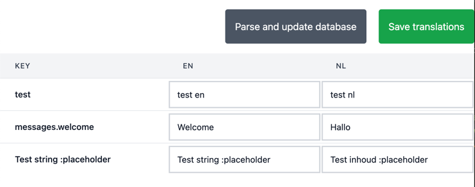

# Laravel Livewire Translation Manager ui

A user interface as a Livewire component for managing translatable interface string using the database.



## Configuration

This package depends on [kkomelin/laravel-translatable-string-exporter](https://github.com/kkomelin/laravel-translatable-string-exporter)
for extracting translations.

It uses [spatie/laravel-translation-loader](https://github.com/spatie/laravel-translation-loader)
for storing/displaying the translation.

By default this package scans `app` and `resources` folders. If you want to scan additional folders or vendor folders
please refer to the [kkomelin/laravel-translatable-string-exporter](https://github.com/kkomelin/laravel-translatable-string-exporter) readme on how to do this.

### Note

This package is not yet battle tested!

You do not have to export the translations, this package takes care of reading and inserting strings into the database.

## TODO

- [ ] Test bigger projects
- [ ] Include/parse lang folder.

## Installation

You can install the package via composer:

```bash
composer require haringsrob/laravel-interface-translation
```

## Usage

You must publish the styles.

```
php artisan vendor:publish --tag=assets
```

Publish the config file and update it to your needs. Make sure you update the middleware used if you want to load
the routes. If you just want to embed the component there is no need to load the routes.

In the config file set the languages you want to manage using the interface.

```
vendor:publish --tag=laravel-interface-translation-config
```

Then you can parse the translatable strings and prepare them in the database.

```
php artisan ui-translations:update
```

Set the translation loader in the config of spatie's translation loader:

```    
'translation_manager' => \Haringsrob\LaravelInterfaceTranslation\TranslationLoaderManager::class,
```

## Embedding the standalone component

This package comes with a standalone livewire component that you can add to any page in your project.

Simply add to any page:
```
<link rel="stylesheet" href="{{ asset('vendor/laravel-interface-translation/style.css') }}">
<livewire:laravel-interface-translation.list />
```

Please make sure Livewire is installed correctly or this will not work.

## Contributing

Please see [CONTRIBUTING](CONTRIBUTING.md) for details.

### Security

If you discover any security related issues, please email haringsrob@gmail.com instead of using the issue tracker.

## Credits

-   [Harings Rob](https://github.com/haringsrob)
-   [All Contributors](../../contributors)

## License

The MIT License (MIT). Please see [License File](LICENSE.md) for more information.

## Laravel Package Boilerplate

This package was generated using the [Laravel Package Boilerplate](https://laravelpackageboilerplate.com).
